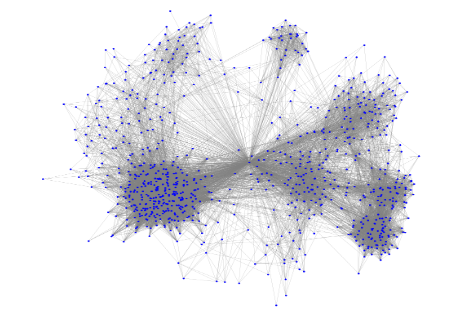
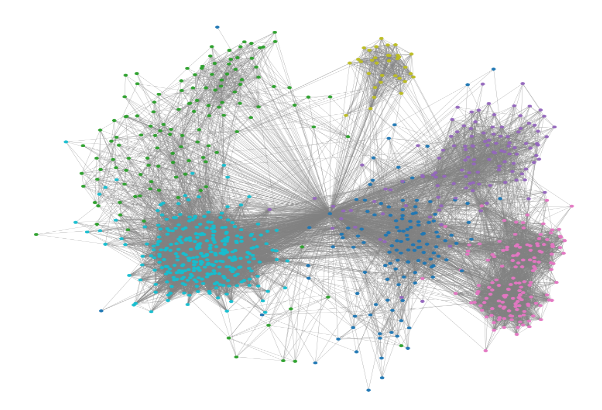
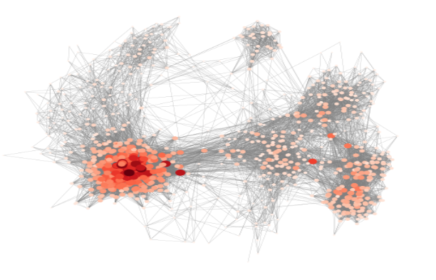
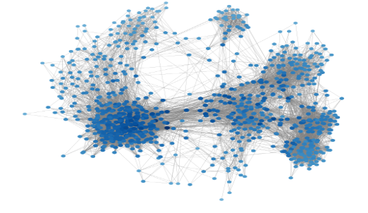
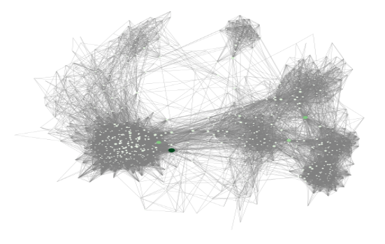
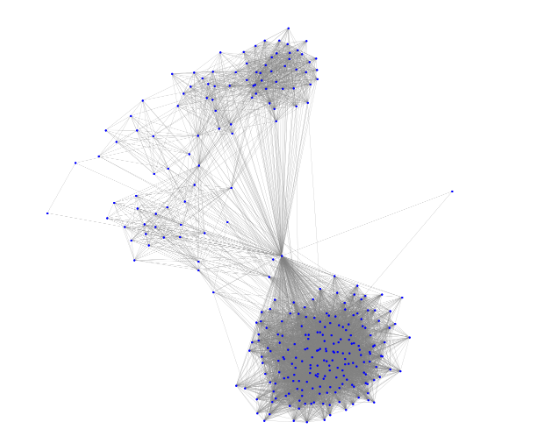
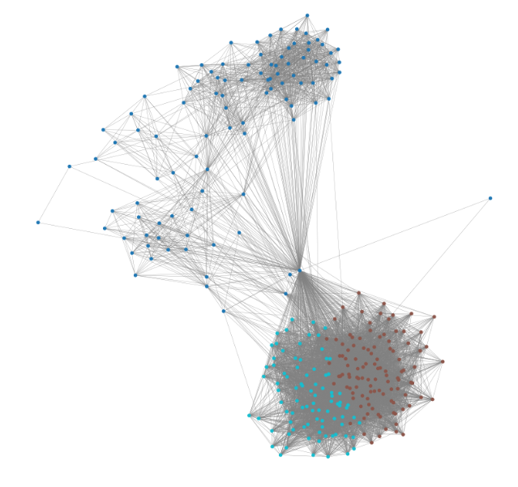
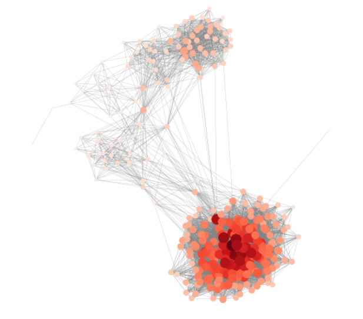
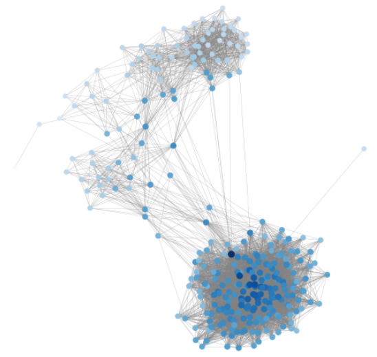
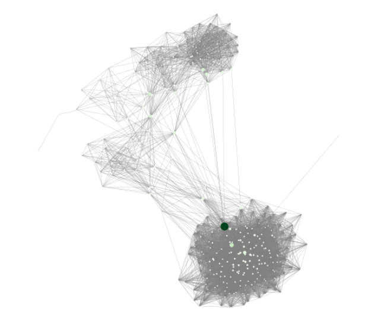

# Network-Graphs-and-Network-Analysis
Please check the last part of this written report to see the open-ended project

This is a homework assignment for the online course "MITx 6.419: Data Analysis: Statistical Modeling and Computation in Applications" that focuses on the application of network analysis techniques. The assignment is an open-ended project that requires me to choose a sociologically relevant research question about either the CAVIAR network or the Facebook or Twitter network from the recitation notebook section.The data used for this assignment can be obtained from publicly available sources such as the Stanford Large Network Dataset Collection (https://snap.stanford.edu/data/index.html) where the Facebook and Twitter ego-networks are available.

I have chosen to investigate the network structure of Facebook friendship connections by utilizing network graph visualization techniques. The primary objective of this analysis is to verify the strength of weak ties theory through empirical analysis. According to this theory, having many weak connections can be more beneficial than having a few strong ones. This project is particularly interesting and useful to me as it allows me to gain insights into the social dynamics of online networks.

In addition, I am aware that network analysis techniques are often utilized in criminology to investigate time-varying criminal networks. I plan to apply similar techniques to study the network structure of connected clients with substance-use disorders. By analyzing the patterns of connections between individuals, I hope to gain a better understanding of the factors that contribute to substance-use disorders and identify potential intervention points for prevention and treatment.

The visualization below used a very cool funcion called force-directed layout function to calculate the position of each node. Generally, The more mutual connections nodes share, The closer those nodes will cluster. Also different clusters of nodes will be pulled away from each other.

# Network Graphs of users with at least 2 common friends

What we observed is that there are actually 6 communities of friends. We can observe that some communities are tangled together(next to each other), while there are some communities that are alienated with each other. One reasonable guess would be that communities of left and right represent friends user 107 knows during different periods of time.

## Degree Centrality

The first method we will use is the one degree centrality. We moved the central user 107 from the graph. This visualization is highlighting friends who have the most mutual friends with user 107. 

## Closeness Centrality

The visualization below used closeness centrality. Being an inverse metric of degree centrality, closeness centrality measures the sum of shortest path to other nodes. 

## Betweenness Centrality

Betweenness centrality measures frequency of a node being located on the shortest path between two other nodes.

# Network Graphs of users with at least 30 common friends

## Degree Centrality

## Closeness Centrality

## Betweenness Centrality

